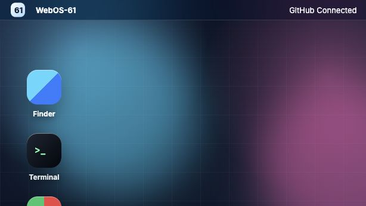

# WebOS-61

A macOS-inspired operating system inside a browser tab.

WebOS-61 turns a GitHub profile into an interactive desktop with draggable windows,
a custom terminal, a macOS-style Finder, and a Chrome-like browser with real web search.

## Features

- macOS-style menu bar, dock, glass windows, and desktop icons
- Draggable window manager with focus stacking
- Finder with Desktop, Downloads, Programme, Dokumente, and Bilder
- Terminal with custom commands
- Chrome app with Google search, URL loading, history controls, reload, and external fallback
- Finder, Terminal, Chrome, and About windows
- Responsive layout for desktop and mobile
- Static frontend: no build step required

## Demo Commands

```bash
help
about
skills
open finder
open chrome
clear
```

## Run Locally

Open `index.html` in a browser, or serve the folder:

```bash
python3 -m http.server 5173
```

Then visit `http://localhost:5173`.

## Preview


